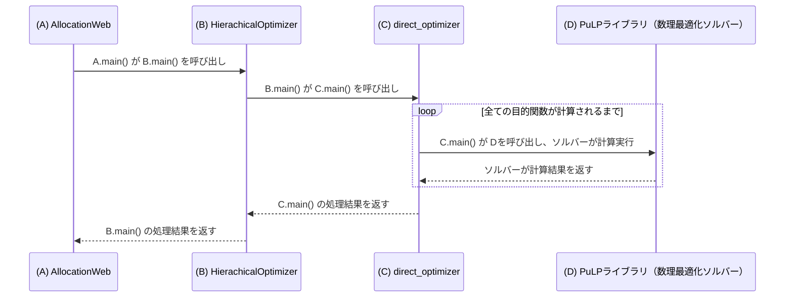

# AllocationOptSim

## 1.概要

工場・月度割り当て最適化シミュレータ

基本予算や実行推定での生産計画を自動で立案するアプリケーションです。
混合整数計画法を用いて最適な生産計画を出力します。


## 2.アプリ起動方法
srcディレクトリに移動し、

```
streamlit run allocation_sim_app.py
```

## 3.シミュレーション実行方法

2025/2/20現在、「製膜工場シミュレーション実施」タブと「バージョン履歴」タブ
のみよく使っている状態。


他のタブは過去必要だったが、今は不要で念のため残している程度。よって、現在のパラメータファイルの
フォーマットではこれらのタブではエラーになる。


## 4.ディレクトリ構成

```
.
├── README.md                                   #本ファイル
├── requirements.txt                            #必要ライブラリ
└── src
    ├── allocation_sim_app.py                   #streamlitアプリのエントリーポイント
    ├── constants.py                            #定数をまとめたファイル
    ├── output_config.py                        #ファイルの出力先pathをまとめたファイル
    ├── setup_paths.py                          #ディレクトリの構成をpythonの検索pathに追加する関数
    ├── 画像1.png                               #ロゴマーク
    ├── tabs                                    #各タブに対応したUIを担当するスクリプト
    ├── optimization                            #最適化に関わるスクリプト
    ├── export                                  #出力に関わる処理及びスクリプト
    ├── libs                                    #ほぼ使っていない
    ├── logs                                    #ほぼ使っていない
    └── test                                    #ほぼ使っていない


```


## 5.簡易シーケンス図（クラスの呼び出し）

「製膜シミュレーション実施」タブからシミュレーションを実行したときの基本的な流れ（一部割愛）




このあと、処理結果をエクセルに出力する処理が入ります。
